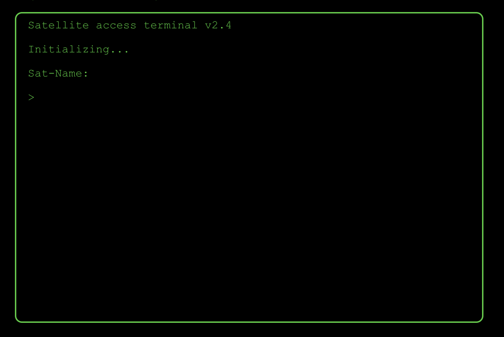

# React Terminal Game Builder

react-terminal-game-builder is a lightweight react-based framework for creating simple terminal games. These games run in a normal browser, and have the appearance of a terminal. This repo provides not only the library itself, but also a test create-react-app project using the framework in two different ways. These are in a monorepo linked together via lerna. 

## Installation

react-terminal-game-builder is installed through your favorite package manager, with few dependencies. 
```
npm install react-terminal-game-builder
```
The module was written in typescript, and types are included, so you don't need a sepearte package for that. You can specifically access those types by importing them.
```
import {Types} from 'react-terminal-game-builder'
```
You can then specify the types by using `Types.OptionTypes` or `Types.GameComponentProps`, etc, etc. 

Once you have that, you're ready to start using the framework!

## tl;dr Usage
Like this!

```
<GameWrapper startingComponent={YourComponentHere} />
```
It gives you something like this!



The GameWrapper will create an instance of your starting component and pass it the following props:
```
interface GameComponentProps {
    overallState: any;
    clearLines: (callback?: Function) => void;
    updateOverallState: (state: any, callback?: Function) => void;
    addLine: (newLines: any[], callback?: Function) => void;
    updateComponent: (newComponent: React.ElementType) => void;
    showGlobalHelp: (callback?: Function) => void;
    writeText: (messageProps: any, callback?: Function) => void;
    updateScroll: () => void;
}
```
These props are how the GameWrapper exposes its inner logic to components that you can create. 

`overallState` is your game's global memory, if you choose to share data between your components (like Redux). `updateOverallState` function updates that state.

`addLine` adds strings or react components to the terminal's list

`updateComponent` changes the currently viewed component inside the GameWrapper (If you choose to change state in that manner)

`showGlobalHelp` adds lines to the terminal showing some common commands. It's up to the implementer to implement these commands. 

`writeText` adds a line to the terminal as if it was typed. It's neat when you want to display messages. 

`updateScroll` scrolls the terminal to the bottom. 

Any function that changes the lines on the terminal has a callback function that will be called after that function completes it's action. It is recommended that you follow this practice, or you may run into multithreading issues. 

## Running and testing locally

Wanna test locally? Cool. Just fork my repo, and run these commands.
```
npm install
npx lerna bootstrap
```
If you want to run the storybook for the library:
```
cd ./packages/react-terminal-game-builder
npm run story
```
If you want to run the test applications
```
cd ./packages/terminal-game-examples
npm start
```
## Helper Components

I made several helper components to assist in building fun terminal games

```
<LoadingHelper> -> Shows a cool loading bar, and has a few options to customize it
<LoginWorkflow> -> Shows a login workflow, allowing restricted logins, putting the information into overallState.login
<OptionHelper> -> Shows a list of choices and allows the user to select one of those choices
<ShowTextHelper> -> Shows a message as if it was being typed out. This component is used in the "writeText" function
<TerminalInputHelper> -> Shows a command line interface, and an <input> accepting user typing. This gives it a terminal like feel. You pass a function as a prop, and it'll pass the command data pack to the function when the user hits 'enter'. See example applications and storybooks
```
All of these are exposed in the package, as can be accessed like so:

```
import {LoadingHelper} from 'react-terminal-game-builder'
import TerminalGameBuilder from 'react-terminal-game-builder'

and then using it like so

<TerminalGameBuilder.LoadingHelper> OR <LoadingHelper>
```
We recomend `{LoadingHelper}` as you won't import the entire lib in every file. 

## Where do I find the docs for these components?

Hopefully one day, you'll find them here. But for now, you'll have to dig into the files to see the prop types. Thankfully they've been well named, so they should be straight forward.

## Can I make issues / pull requests?

Sure! Though as this isn't my full time gig, you'll probably get a quicker response on pull requests (as there's less work for me to do.) :)

If you see a glaring issue, please feel free to make that issue in Github and I'll get to it as soon as I can, but I may not get to feature requests quickly. 

## Last words

This is a work in progress, I made this in my spare time over a holiday weekend, so be kind in your judgements.

I hope you enjoy playing with what I built!